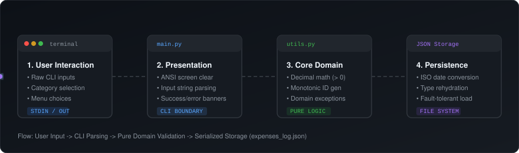
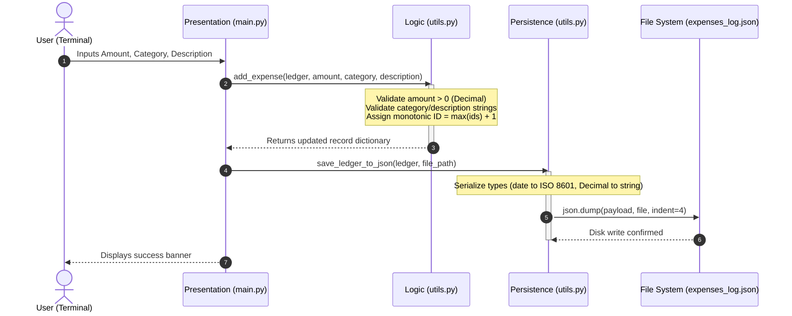

# Expense Tracker

A command-line personal expense manager built with Python 3.12, featuring exact decimal arithmetic, input invariant validation, and fault-tolerant JSON persistence.

[](https://www.python.org/)
[](tests/test_expense_tracker.py)
[](../LICENSE)

---

## Overview

The Expense Tracker is the first project in our 10-project practical curriculum. The goal was to build a clean terminal application that tracks daily expenditures without mixing presentation code with business rules.

The codebase strictly separates user interface concerns from business logic:
- `main.py` manages the terminal menu, ANSI screen clears, user prompts, and error displays.
- `utils.py` contains all validation rules, calculation logic, ID generation, and file storage functions.
- `tests/test_expense_tracker.py` verifies all calculation routines, boundary invariants, and persistence flows with 17 unit tests.

---

## Architecture

The following diagram illustrates the data flow from user interaction down to disk persistence:



### Data Lifecycle



---

## Features and Milestones

Development was divided into four iterative milestones:

| Milestone | Scope | Deliverables | Verification |
| :-: | :--- | :--- | :--- |
| **01** | **In-Memory Core Engine** | `add_expense`, `calculate_total_expenditure`, custom exception hierarchy (`InvalidExpenditureError`, `InvalidAmountError`), exact `Decimal` arithmetic. | 7 unit tests covering valid records, zero amounts, negative values, and empty text. |
| **02** | **Record Deletion & Aggregations** | `delete_expense_by_id`, `calculate_category_aggregate`, `get_category_counts`, interactive category selection in terminal. | 7 unit tests covering sequential IDs, successful deletions, and missing ID exceptions. |
| **03** | **Plain-Text Persistence** | File saving and loading via `expenses.txt`, delimiter splitting with `maxsplit=4`, cold-start boot fallback. | 2 unit tests covering non-existent files and text file roundtripping. |
| **04** | **JSON Persistence & Recovery** | Structured serialization in `expenses_log.json`, ISO date parsing, Decimal string conversion, `json.JSONDecodeError` recovery. | 2 unit tests covering complete JSON roundtrip rehydration and corrupted file handling. |

---

## Post-Mortem: Bugs and Lessons Learned

Here are the six technical problems encountered during development, their root causes, and how each was resolved:

### 1. Binary Floating-Point Rounding Error
- **Defect**: Calculating sums with standard floats produced small inaccuracies (for example, `0.1 + 0.2` evaluated to `0.30000000000000004`).
- **Root Cause**: IEEE 754 binary floating-point representation cannot represent base-10 fractions precisely.
- **Resolution**: Replaced all float conversions with Python's `Decimal` type from the `decimal` standard library module.
- **Lesson**: Financial software must never use standard binary floating-point types for monetary values.

### 2. Coupling User Input with Core Business Logic
- **Defect**: Early versions had `input()` and `print()` calls inside `add_expense()`.
- **Root Cause**: Mixing presentation concerns with calculation logic.
- **Resolution**: Removed all I/O side effects from `utils.py`. The function now takes validated arguments and returns dictionaries or raises exceptions.
- **Lesson**: Pure functions without I/O side effects are trivial to test automatically using `pytest` without needing complex mocking.

### 3. Duplicate Identifiers Following Record Deletion
- **Defect**: Generating record IDs using `len(ledger) + 1` created duplicate IDs after deleting an earlier record.
- **Root Cause**: A collection's current length does not track its historical sequence.
- **Resolution**: Refactored the ID generator to calculate `max([item["id"] for item in ledger], default=0) + 1`.
- **Lesson**: Primary keys must be monotonic and independent of mutable collection length.

### 4. Delimiter Splitting Collisions in Text Files
- **Defect**: Saving an expense with a description containing commas (such as `"Coffee, milk, and sugar"`) caused `line.split(",")` to split the record into 7 elements instead of 5.
- **Root Cause**: The comma was used simultaneously as a column separator and as user data inside the description field.
- **Resolution**: Used `line.split(",", maxsplit=4)` to preserve the final description column as a single string.
- **Lesson**: Delimited text files break on raw user inputs unless explicit escaping or fixed split bounds are enforced.

### 5. Syntax Error in Exception Handling Grammar
- **Defect**: The test runner raised `SyntaxError: invalid syntax` on the following block:
  ```python
  except:
      json.JSONDecodeError():
      return []
  ```
- **Root Cause**: Python expects the target exception class on the `except` header line before the colon. Placing `json.JSONDecodeError():` on its own line created an illegal expression with a trailing colon.
- **Resolution**: Refactored to standard Python exception syntax:
  ```python
  except json.JSONDecodeError:
      return []
  ```
- **Lesson**: An `except` statement declares which exception type to catch; the indented body defines what actions to execute when the exception occurs.

### 6. Type Degradation Across Serialization Boundaries
- **Defect**: Deserializing data from JSON converted `amount` values to strings and `date` values to strings, breaking math functions during runtime.
- **Root Cause**: JSON only supports primitive types (strings, numbers, lists, objects, booleans, and null). It does not natively store Python `Decimal` or `datetime.date` objects.
- **Resolution**: Built an explicit rehydration stage during file reads:
  ```python
  "amount": Decimal(item["amount"]),
  "date": date.fromisoformat(item["date"])
  ```
- **Lesson**: Data in storage differs from data in memory. Persistence layers must explicitly reconstruct domain objects when reading from disk.

---

## Data Model and Invariant Rules

### Schema Contract

```python
{
    "id": 1,                       # Unique positive integer (>= 1)
    "date": date(2026, 9, 24),     # Python datetime.date object
    "category": "Food",            # Non-empty string
    "amount": Decimal("15.50"),    # Positive Decimal value (> 0)
    "description": "Lunch"         # Non-empty string
}
```

### Invariants Enforced
1. **Amount Invariant**: Must be coercible to `Decimal` and strictly greater than zero (`> 0`). Non-numeric strings or non-positive values raise `InvalidAmountError` or `InvalidOperation`.
2. **Category Invariant**: Must contain at least one non-whitespace character. Violations raise `InvalidCategoryError`.
3. **Description Invariant**: Must contain at least one non-whitespace character. Violations raise `InvalidExpenditureError`.
4. **Identity Invariant**: Deleting or accessing an ID that does not exist in the ledger raises `ExpenseNotFoundError`.

---

## Running Tests

The test suite uses `pytest` and covers nominal, boundary, and error recovery conditions:

```bash
# From within the expense_tracker directory:
../.venv/bin/python -m pytest tests -v
```

### Test Summary
- **17 tests collected and passing**:
  - 5 input validation tests (positive amount, zero amount, negative amount, empty category, empty description).
  - 2 data type tests (authentic string formatting, sequential monotonic IDs).
  - 5 calculation and aggregation tests (total spending, multiple item sums, category aggregates, category filters, category frequency counters).
  - 2 deletion tests (successful record removal, missing ID error handling).
  - 3 persistence tests (missing file cold start, JSON roundtrip rehydration, corrupted JSON file recovery).

---

## Recommended Reading

For developers wanting to deepen their understanding of these architectural patterns:

1. **A Philosophy of Software Design** by John Ousterhout: Practical guide on designing deep modules with simple interfaces that hide internal complexity.
2. **Architecture Patterns with Python** by Harry Percival and Bob Gregory: Demonstrates how to keep domain models pure and decoupled from frameworks and storage layers.
3. **Clean Code in Python** by Mariano Anaya: Explains idiomatic Python, proper exception hierarchies, and the Single Responsibility Principle.
4. **Designing Data-Intensive Applications** by Martin Kleppmann: Covers file storage formats, serialization limits, and schema evolution.
